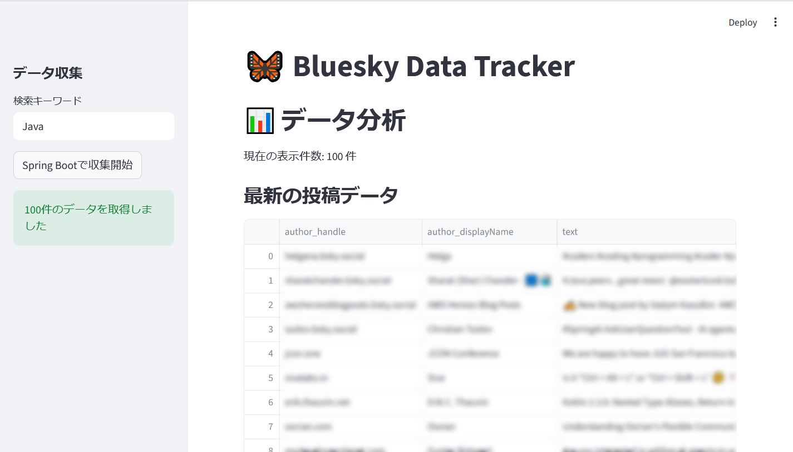
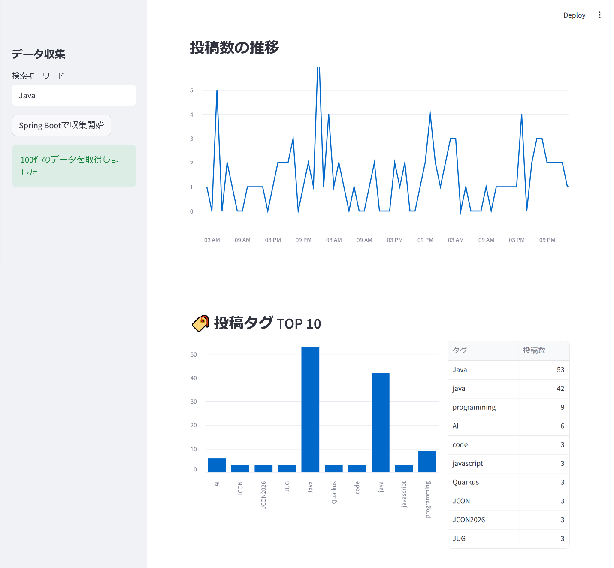
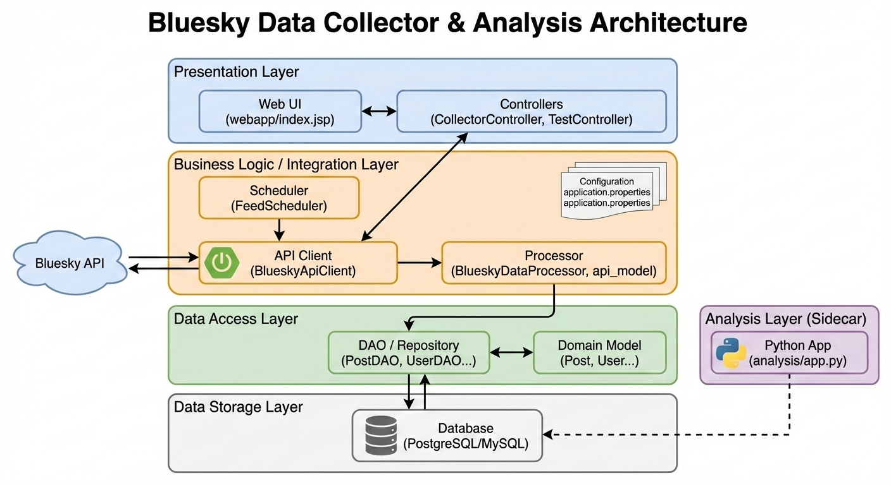

# Bluesky Data Tracker

Blueskyから特定のキーワードを含む投稿を自動・手動で収集し、時系列分析やタグの傾向を可視化するためのフルスタック・データ分析システムです。






## 📋 プロジェクト概要

このシステムは、Bluesky API（AT Protocol）を利用して、Java (Spring Boot) でデータを収集・蓄積し、Python (Streamlit) で直感的なデータ分析・可視化を行います。
単なるテキストの保存だけでなく、ユーザー情報、投稿統計（いいね数、リポスト数など）、ハッシュタグをリレーショナルデータベースに正規化して保存します。
また、**「追跡したい検索語（Search Word）」と、「投稿に含まれる自然なタグ（Tag）」**を分けて管理することで、精度の高いトレンド分析を可能にしています。

### 主な機能
- **自動定期実行**: `Spring Scheduling` により、5分間隔で自動的にAPIをポーリングします。
- **ページネーション管理（定期実行時）**: APIの `cursor` を保持し、次回の実行時に未取得の投稿から取得を再開します。
- **オンデマンド実行**: Python UIからのリクエストによる即時キーワード収集を行います。
- **データ正規化**: ユーザー、投稿、タグを分離して保存し、ハッシュタグは中間テーブルで管理します。
- **検索語とタグの分離管理**: 「何を検索したか」という文脈と「どんなタグが付いていたか」という事実を分けてDB管理します。
- **重複チェック**: 投稿固有の `URI` を利用して、DBへの二重登録を防止します。
- **データ可視化ダッシュボード**: 投稿数の推移、人気タグランキングなどをグラフで表示。


## 🏗 技術スタック

### Backend (Data Collection)
- **Java**: 17+
- **Framework**: Spring Boot 3.3.x (Spring Data JPA)
- **HTTP Client**: Spring RestClient
- **JSON Library**: Jackson
- **Database**: PostgreSQL (推奨)

### Frontend & Analysis (UI)
- **Python**:  3.x / Streamlit
- **Library**: Pandas, Requests


## 🗄 データベース構造

以下の4つのテーブルでデータを管理しています。

1.  **users**: 投稿者のプロフィール情報（DID、ハンドル名、表示名）
2.  **posts**: 投稿本文、投稿日時、統計情報（いいね・リポスト等）、言語設定
3.  **tags**: ハッシュタグのマスター（一意のタグ名）
4.  **post_tags**: 投稿とタグを紐付ける中間テーブル（多対多の関係を解消）
5.  **search_words**: システムが追跡している検索キーワードのマスター。
6.  **post_search_results**: キーワードと投稿を紐付ける中間テーブル。データ取得日時を保持する。

## 🚀 セットアップと実行

### 1. データベースの準備
SQLなどで以下の構造を持つデータベースを作成してください。JPAの `hibernate.ddl-auto` を設定している場合は、エンティティから自動生成も可能です。
```
create table users (
  id serial not null
  , did character varying(255) not null
  , handle character varying(255) not null
  , display_name character varying(255)
  , created_account_at character varying(255)
  , primary key (id)
);
```
```
create table posts (
  id serial not null
  , text text not null
  , created_at character varying(255) not null
  , author_id integer
  , language character varying(255) not null
  , cid character varying(255) not null
  , indexed_at character varying(255) not null
  , like_count integer not null
  , reply_count integer not null
  , repost_count integer not null
  , uri character varying(255)
  , bookmark_count integer not null
  , quote_count integer not null
  , primary key (id)
  , foreign key (author_id) references users(id)
);
```
```
create table tags (
  id serial not null
  , tag character varying(255) not null
  , primary key (id)
);
```
```
create table post_tags (
  post_id integer not null
  , tag_id integer not null
  , primary key (post_id, tag_id)
  , foreign key (post_id) references posts(id) on delete cascade
  , foreign key (tag_id) references tags(id) on delete cascade
);
```
```
create table search_words (
  id serial primary key
  , word character varying(255) not null unique
);
```
```
create table post_search_results (
  id serial not null
  , post_id integer not null,
  , search_word_id integer not null,
  , fetched_at timestamp not null,
  , primary key (search_word_id, post_id)
  , foreign key (posts_id) references posts(id) on delete cascade
  , foreign key (word_id) references search_words(id) on delete cascade
);
```

### 2. 設定の変更
`.env` にデータベース接続情報を記述します。
```
# 接続先のURL（データベース名などを指定）
DATABASE_URL = jdbc:postgresql://localhost:5432/your_database
# ユーザー名
DATABASE_USER = your_username
# パスワード
DATABASE_PASSWORD = password
```

### 3. ビルドと実行
1. Java バックエンドの起動
```
/mvnw spring-boot:run
```
2. Python フロントエンドの起動
必要なライブラリをインストールし、Streamlitを起動します。
```
pip install streamlit pandas requests sqlalchemy psycopg2-binary python-dotenv
streamlit run app.py
```

## 🛠 API エンドポイント 
(Java)Python等のクライアントから以下のエンドポイントを利用可能です。
メソッド|パス|説明
--|--|--
POST|/api/v1/collector/run?q={word}|指定したワードで収集を実行しDBに保存。
GET|/api/v1/collector/search?q={word}|DB内から指定ワードに関連する投稿を抽出して返す。

```
./mvnw spring-boot:run
```

## 🛠 コンポーネント解説

クラス名|カテゴリ|解説
--|--|--
BlueskyTrackerApplication|起動設定|Spring Bootアプリケーションの起動クラス。
BlueskyApiClient|通信|Bluesky APIへアクセスし、投稿データの取得を担うクライアント。
CollectorController|制御|データ収集処理を外部から呼び出すためのAPIコントローラ。
FeedScheduler|自動実行|指定した時間間隔でデータ取得を自動的に実行するスケジューラ。
BlueskyDataProcessor|整形APIの|レスポンス（JSON）を解析し、DB保存用モデルに詰め替える。
Post / User / Tag|モデル|投稿、ユーザー、ハッシュタグの基本情報を保持するエンティティ。
SearchWord|モデル|データ収集の対象となる検索ワードを管理するエンティティ。
PostTag|モデル|投稿(Post)とタグ(Tag)を紐付ける中間モデル。
PostTagPK|主キー定義|PostTagの複合主キー（PostID,TagID）を定義するクラス。
PostSearchResults|モデル|ワードと投稿の関連性を記録する中間モデル。
PostSearchResultsPK|主キー定義|	PostSearchResultsの複合主キー（SearchWordID,PostID）を定義するクラス。
PostRepository|DB操作|SpringDataJPAを利用した、Postエンティティに対するDBアクセス。
各DAO (PostDAO等)|DB操作|リポジトリと連携し、より詳細なデータ検索や更新ロジックを実装する層。
各Json (AuthorJson等)|APIモデル|BlueskyAPIの階層深いJSON構造をマッピングするための受取用クラス群。
app.py (Python)|分析|収集済みデータに対して統計や分析処理を行う。



## 今後の目標
- ハッシュタグの 共起ネットワーク（Co-occurrence Network） を構築
- 時系列で比較することで、コミュニティ文脈の変化を捉える


